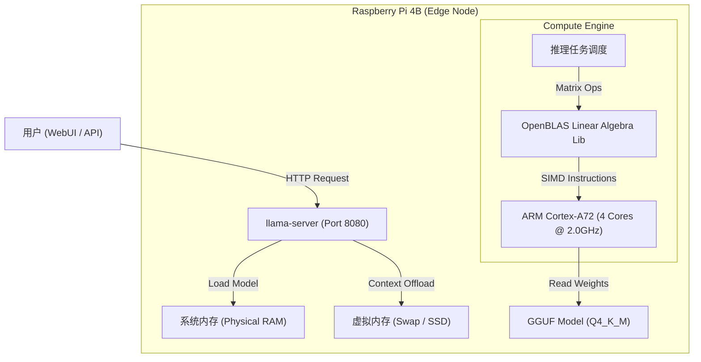

# DeepSeek-R1-Distill-Qwen-1.5B on Raspberry Pi 4B (4GB)

## 📖 项目简介 (Introduction)

本项目记录了在资源受限的边缘计算设备 **Raspberry Pi 4B (4GB RAM)** 上，部署并深度优化 **DeepSeek-R1-Distill-Qwen-1.5B** 大语言模型的全过程。

针对 4GB 内存的物理瓶颈，本项目采用了一套**全链路优化方案**：

1.  **操作系统级**：剥离图形界面 (Headless)，重构虚拟内存 (Swap)，移除 ZRAM。
2.  **硬件级**：CPU 超频至 **2.0GHz**，显存压缩至 16MB。
3.  **计算引擎级**：基于 `llama.cpp` 源码开启 **OpenBLAS** 矩阵加速与 NEON 指令集优化。
4.  **推理策略级**：启用 **Flash Attention**，通过 `mlock` 锁定物理内存，实现 **4096 上下文窗口**的稳定运行。

-----

## 🏗 系统架构 (System Architecture)

下图展示了本项目的软硬件调用数据流：



-----

## 📊 性能基准 (Benchmarks)

基于实际部署环境的监控数据 (监控工具: `vcgencmd`, `htop`, `llama-server logs`)：

| 指标 (Metric) | 测量值 (Value) | 说明 (Notes) |
| :--- | :--- | :--- |
| **推理速度 (Eval Speed)** | **3.15 - 5.00 Tokens/s** | 纯 CPU 推理的物理极限 |
| **内存占用 (RAM Usage)** | **\~54% (2.1GB)** | 剩余空间用于 4k 上下文缓存 |
| **CPU 温度 (Temp)** | **34.6°C** (Idle) / **\<55°C** (Load) | 配合主动散热风扇 |
| **上下文窗口 (Context)** | **4096 Tokens** | 支持长文档 (RAG) 读取 |
| **启动时间 (Load Time)** | **\< 5 秒** | 禁用 mmap，强制预加载 |
| **系统稳定性** | **S级 (Excellent)** | 无热节流 (Throttling)，无 OOM 崩溃 |

-----

## 📂 目录结构 (Directory Structure)

建议采用以下标准目录结构以便于脚本管理：

```text
/home/cjj/ (~)
├── llama.cpp/          # 推理引擎源代码及编译产物
│   ├── build/bin/      # 存放 llama-server 可执行文件
│   └── ...
├── models/             # 模型文件存放处
│   └── DeepSeek-R1-Distill-Qwen-1.5B-Q4_K_M.gguf
└── scripts/            # 自动化运维脚本库
    ├── start_deepseek.sh   # 一键启动脚本
    ├── monitor.sh          # 硬件监控看板
    └── update_llama.sh     # 引擎自动更新脚本
```

-----

## 🛠️ 部署指南 (Step-by-Step Guide)

### 1\. 环境初始化与底层优化

**目标**：释放被图形界面占用的 300MB+ 内存，并突破 1.5GHz 频率限制。

#### 1.1 切换至纯命令行模式 (Console)

```bash
sudo raspi-config
# 操作路径:
# 1 System Options -> S5 Boot / Auto Login -> B2 Console Autologin
# 完成后选择 Reboot 重启
```

#### 1.2 硬件超频与显存释放

编辑系统启动配置：

```bash
sudo nano /boot/firmware/config.txt
# 注意：旧版本系统路径可能为 /boot/config.txt
```

在文件末尾添加以下参数（需配备散热风扇）：

```ini
# [Overclocking]
over_voltage=6
arm_freq=2000

# [Memory Optimization]
# 将显存限制在最小的 16MB，将更多内存留给 CPU
gpu_mem=16
```

#### 1.3 虚拟内存 (Swap) 深度重构

移除占用 CPU 的 ZRAM，启用大容量硬盘 Swap 作为防崩溃保障。

```bash
# 1. 彻底移除 ZRAM (性能杀手)
sudo apt purge systemd-zram-generator zram-tools -y

# 2. 安装传统 Swap 管理工具
sudo apt install dphys-swapfile -y

# 3. 配置 2GB Swap
sudo nano /etc/dphys-swapfile
# 修改内容: CONF_SWAPSIZE=2048

# 4. 应用更改
sudo dphys-swapfile setup
sudo dphys-swapfile swapon

# 5. 降低 Swap 使用倾向 (提升流畅度)
echo "vm.swappiness=10" | sudo tee -a /etc/sysctl.conf
```

-----

### 2\. 编译高性能推理引擎

**目标**：针对 Cortex-A72 架构编译 `llama.cpp`，显式开启 OpenBLAS 加速。

#### 2.1 安装依赖链

*(可选) 如果网络受限，请在命令前加上代理设置，例如 `export http_proxy=...`*

```bash
sudo apt update
sudo apt install git build-essential cmake libopenblas-dev libcurl4-openssl-dev -y
```

#### 2.2 源码编译

```bash
cd ~
git clone https://github.com/ggerganov/llama.cpp
cd llama.cpp

# 核心步骤：生成构建配置 (开启 OpenBLAS)
cmake -B build -DGGML_BLAS=ON -DGGML_BLAS_VENDOR=OpenBLAS

# 4核并行编译 (约需 3-5 分钟)
cmake --build build --config Release -j 4
```

-----

### 3\. 模型部署

**目标**：获取适配 4GB 内存的量化模型文件。

```bash
mkdir -p ~/models
# 下载 DeepSeek-R1-Distill-Qwen-1.5B (Q4_K_M 量化版)
wget -O ~/models/DeepSeek-R1-Distill-Qwen-1.5B-Q4_K_M.gguf \
https://huggingface.co/unsloth/DeepSeek-R1-Distill-Qwen-1.5B-GGUF/resolve/main/DeepSeek-R1-Distill-Qwen-1.5B-Q4_K_M.gguf
```

-----

## 🚀 4. 自动化脚本 (Automation)

为了便于长期维护，建立了 `~/scripts` 目录并已加入系统 PATH。

### 4.1 启动脚本 (`start_deepseek.sh`)

集成了 **4096 上下文**、**Flash Attention** 和 **内存锁定** 优化的启动命令。

```bash
#!/bin/bash
cd ~/llama.cpp/build/bin

echo "🚀 Starting DeepSeek-R1 (1.5B)..."
echo "⚙️  Config: 4k Context | FlashAttn: ON | Threads: 4"
echo "🌐 WebUI: http://localhost:8080"

# 核心启动指令
sudo ./llama-server \
  -m ~/models/DeepSeek-R1-Distill-Qwen-1.5B-Q4_K_M.gguf \
  --host 0.0.0.0 --port 8080 \
  -t 4 \          # 跑满4核
  -c 4096 \       # 4k长上下文
  -b 64 \         # 低Batch Size省内存
  --mlock \       # 锁定物理内存
  --no-mmap \     # 禁用内存映射
  -fa on          # 开启Flash Attention
```

### 4.2 监控看板 (`monitor.sh`)

实时监控核心硬件指标，防止超频过热。

```bash
#!/bin/bash
watch -n 1 "echo '=== CPU Status ==='; vcgencmd measure_clock arm; vcgencmd measure_temp; vcgencmd get_throttled; echo ''; echo '=== Memory ==='; free -h | grep Mem"
```

### 4.3 引擎更新 (`update_llama.sh`)

一键拉取最新代码并重新编译。

```bash
#!/bin/bash
# 请根据实际情况修改代理 IP
export http_proxy=http://192.168.101.11:7890
export https_proxy=http://192.168.101.11:7890

cd ~/llama.cpp
git pull
rm -rf build
cmake -B build -DGGML_BLAS=ON -DGGML_BLAS_VENDOR=OpenBLAS
cmake --build build --config Release -j 4
echo "✅ Update Complete!"
```

-----

## ❓ 5. 故障排查 (Troubleshooting)

  * **现象：SSH 连接断开，树莓派死机**
      * **原因**：超频至 2.0GHz 电压不稳或过热。
      * **解法**：修改 `/boot/firmware/config.txt`，将 `arm_freq` 降至 `1800`，或检查散热风扇。
  * **现象：启动报错 `failed to allocate memory`**
      * **原因**：Swap 未生效或显存占用过高。
      * **解法**：执行 `free -h` 检查 Swap 是否为 2GB；检查 `config.txt` 中是否设置了 `gpu_mem=16`。
  * **现象：回复速度极慢 (\< 1 Token/s)**
      * **原因**：使用了 ZRAM 或未开启 OpenBLAS。
      * **解法**：参考 [1.3 节](https://www.google.com/search?q=%2313-%E8%99%9A%E6%8B%9F%E5%86%85%E5%AD%98-swap-%E6%B7%B1%E5%BA%A6%E9%87%8D%E6%9E%84) 移除 ZRAM；参考 [2.2 节](https://www.google.com/search?q=%2322-%E6%BA%90%E7%A0%81%E7%BC%96%E8%AF%91) 重新编译。

-----

## ♻️ 6. 系统恢复 (System Restoration)

如需将树莓派恢复至初始状态：

1.  **恢复桌面**: `sudo raspi-config` -\> System Options -\> Boot -\> Desktop Autologin.
2.  **取消超频**: 编辑 config.txt，注释掉 `arm_freq`, `over_voltage`, `gpu_mem`。
3.  **恢复 Swap**: 编辑 `/etc/dphys-swapfile` 改回 `CONF_SWAPSIZE=100`。
4.  **清理文件**: `rm -rf ~/llama.cpp ~/models ~/scripts`。
5.  **重启**: `sudo reboot`.

-----

## 🙏 致谢 (Acknowledgments)

本项目是在研究生一年级学习阶段实现的，特别感谢以下开源社区与工具的支持：

  * **[DeepSeek-AI](https://github.com/deepseek-ai)**: 提供了强大的 R1 开源模型及蒸馏技术。
  * **[llama.cpp](https://github.com/ggerganov/llama.cpp)**: 提供了极其高效的 ARM 架构推理框架。
  * **[Unsloth](https://github.com/unslothai)**: 提供了适配边缘设备的 GGUF 量化模型。
  * **[OpenBLAS](https://www.openblas.net/)**: 提供了关键的矩阵运算加速库。
  * **Google Gemini**: 在全流程部署、故障排查及文档撰写中提供了核心技术支持 (Thought Partner)。
